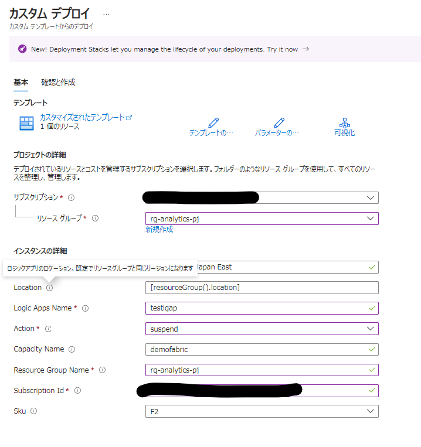
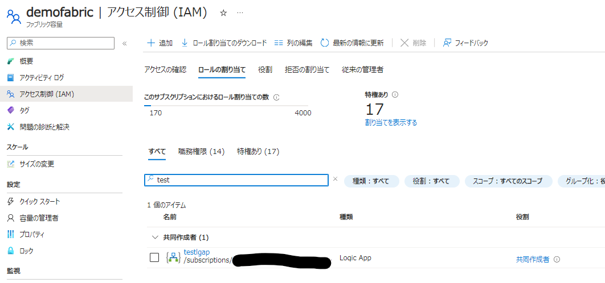
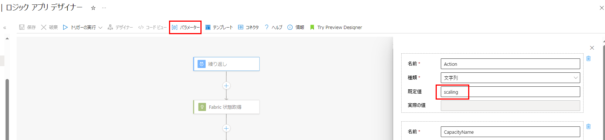

## 手順

1. をデプロイします。（ロジックアプリが有効済みでデプロイされます）
actionパラメータでは、ロジックアプリの実行するいずれかの操作を指定できます  
停止したい場合：suspend  
開始したい場合：resume  
SKU変更したい場合：scaling  
※このロジックアプリでは実行するのは上記いずれか1つの操作のみとなります。改修するか、操作ごとにロジックアプリをデプロイしてください

2. 作成されたlogic apps を Fabric Capacity のAzure RBAC 共同作成者に割り当て

3. 必要に応じて、デザイナーから各種のパラメータを調整可能
   1. 実行時刻
   
   2. パラメータ内容
   
